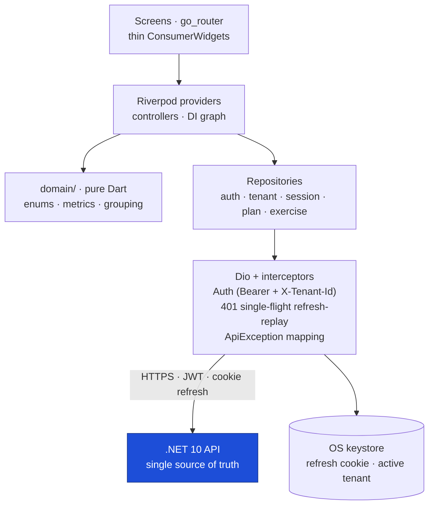

<div align="center">

# 🏋️ GymBro Mobile

**The at-the-gym Flutter client for the GymBro training platform — log workouts, follow assigned plans, and track progress in real time.**

[](https://flutter.dev)
[](https://dart.dev)
[](#-getting-started)
[](https://riverpod.dev)
[](#-testing)
[](analysis_options.yaml)

</div>

---

## 📖 Project Overview

**GymBro Mobile** is the native companion to the GymBro web portal. It is **not a standalone product** — it
consumes the same production **.NET API** the Angular portal does, so the backend remains the single source of
truth for authorization, business rules, and metrics. The app **renders and lightly derives; the server
decides.**

It adapts to the signed-in user's active workspace and serves **two roles**:

| Role | Who | What they do here |
|---|---|---|
| 🏃 **Trainee** _(Client)_ | Gym members | Train on assigned plans and log every set — the primary experience. |
| 🧑‍🏫 **Coach** _(Owner)_ — "coach-lite" | Gym owners/coaches | Manage clients, invites, and assignments on the go. Plan _authoring_ stays in the portal. |

**Key capabilities:** secure auth with silent session restore · multi-gym workspaces with join-by-code · assigned
plan consumption with server-side visibility redaction · the complete workout-session lifecycle (start, log,
edit, skip, substitute, rest timer, complete/abandon) · client-derived progress, PRs, and history.

---

## 📸 Screenshots

> Replace the placeholders by dropping images into [`docs/screenshots/`](docs/screenshots/) — filenames are listed there.

<div align="center">

| Login | Workout Log | Live Session |
|:---:|:---:|:---:|
|  |  |  |
| **Plan** | **Progress** | **Profile** |
|  |  |  |

</div>

---

## ✨ Features

### 🔐 Authentication
- Email/password **login** and **sign-up** (sign-up can join a coach via invite code in one step)
- **Forgot / reset password** flow
- **Silent session restore** on cold start (no re-login if the refresh cookie is valid)
- Access token kept **in memory**; refresh cookie persisted in the **OS keystore**
- Single-flight **401 refresh-and-replay** — one refresh per expiry, transparent to the UI

### 🏢 Workspaces & Multi-Tenancy
- List, select, and **switch** between gyms you belong to
- **Join a coach by invite code**
- Switching a workspace **resets all tenant-scoped state** — no cross-gym data bleed
- Every tenant-scoped request carries the membership-validated `X-Tenant-Id` header

### 📋 Plans
- Browse **assigned plans** (read-only)
- **Full / Guided / Blind** visibility modes, all redacted **server-side** — the UI renders what it's given
- Program hero (current week, days/week, visibility) with per-day workout breakdown

### ⏱️ Workout Session _(the centerpiece)_
- **Start from a plan** or **ad-hoc**, or **resume** the single active session (one at a time, enforced server-side)
- Log / edit / delete **sets** with weight & reps **steppers** and inline e1RM preview
- **Skip**, **substitute** (from the exercise catalog), and **add / remove** exercises
- **Rest timer** that auto-starts after each logged set
- **Complete** (with overall RPE) or **abandon**, then jump to the session summary

### 📈 Progress & History
- Session timeline grouped into **Monday-anchored weeks**
- **Volume**, **personal records (PRs)**, and weekly goal tracking — all **client-derived** from the API
- Detailed per-session breakdown (KPIs, per-exercise sets, PR highlights)

### 🧑‍🏫 Coach (coach-lite)
- **Clients roster** + invite **generate / list / revoke**
- **Plan view** + **assign** (pins the plan version, sets visibility & hide flags)
- **Client monitor** — assignments + sessions, **pause/resume**, **apply-latest**
- **Self-train** your own assigned plans

> [!NOTE]
> Authorization is always enforced by the API. The role-adaptive UI and route guards are **UX-only** —
> a coach action a user can't perform is also rejected server-side.

---

## 🧰 Tech Stack

| Area | Technology |
|---|---|
| Framework | **Flutter** (Material 3) |
| Language | **Dart** |
| State management | **Riverpod** (`flutter_riverpod`) |
| Dependency injection | **Riverpod providers** (the provider graph is the DI container — no separate DI package) |
| Routing | **go_router** (`StatefulShellRoute`) |
| Networking | **Dio** + `cookie_jar` + `dio_cookie_manager` |
| Local storage | **flutter_secure_storage** (OS keystore — refresh cookie + active tenant) |
| Typography | **google_fonts** (Inter Tight) |
| Architecture | Feature-first, layered, server-authoritative |
| Testing | `flutter_test` + `mocktail` |
| Backend | .NET 10 API (separate repo) |

---

## 🏛️ Project Architecture

**Style:** feature-first and layered, with a strict **server-authoritative** rule — the API owns
authorization, the session state machine, visibility redaction, and metric math; the client renders and lightly
derives.

**Separation of concerns**

- **Presentation** (`features/*`) — thin `ConsumerWidget`/`ConsumerStatefulWidget` screens. No business logic.
- **State** (Riverpod providers/controllers) — server state, derived state, and the DI graph. Tenant-scoped
  providers reset on workspace switch.
- **Data** (`data/repositories`, `data/models`) — one repository per API area; hand-written DTOs that mirror the
  C# contracts with tolerant enum parsing.
- **Domain** (`domain/`) — **pure Dart** (no Flutter imports): tolerant enums, session metrics, week grouping.
  Trivially unit-testable.
- **Core** (`core/*`) — Dio + interceptors, token/tenant stores, secure storage, design tokens & theme.
- **Shared** (`shared/widgets`) — ~40 reusable, token-driven widgets behind a single barrel import.



Deeper detail (as-built, with the deviations from the original plan) lives in
[`docs/ARCHITECTURE.md`](docs/ARCHITECTURE.md).

---

## 🗂️ Folder Structure

```
lib/
├── main.dart            # bootstrap: load tenant → silent refresh → pre-resolve role → runApp
├── app/                 # MaterialApp.router, go_router (role-adaptive shell), theme entry
├── core/
│   ├── config/          # AppConfig — base URL + timeouts, resolved from Dart defines
│   ├── network/         # Dio, AuthInterceptor, RefreshInterceptor, ApiException, secure cookie jar
│   ├── auth/            # TokenStore (in-memory access) · TokenRefresher (single-flight)
│   ├── tenant/          # TenantStore (sync active X-Tenant-Id + role, persisted)
│   ├── tokens/ + theme/ # design primitives → GbColors ThemeExtension → ThemeData
│   └── providers.dart   # DI graph (stores → dios → refresher)
├── domain/              # PURE Dart: enums (tolerant wire), session metrics, week grouping
├── data/
│   ├── models/          # hand-mirrored DTOs (camelCase JSON, tolerant enums)
│   └── repositories/    # auth · tenant · session · plan · exercise
├── features/            # auth · tenant · shell · log · plan · session · progress · profile · coach
│                        #   each: Riverpod controller/providers + thin screens
└── shared/widgets/      # ~40 reusable widgets + design-system barrel (import widgets.dart)
```

<details>
<summary>Repository layout (platforms, config, docs, tests)</summary>

```
gymbroapp/
├── android/ · ios/ · web/   # committed platform runners
├── config/                  # dev.json · prod.json (Dart-define env files)
├── lib/                     # application code (see above)
├── test/                    # unit + wire-parsing + a11y tests
├── docs/                    # ARCHITECTURE · MOBILE_MVP_STATUS · DESIGN_COMPLIANCE · design-reference · screenshots
├── analysis_options.yaml    # lints (flutter_lints + strict casts/raw-types)
└── pubspec.yaml
```

</details>

---

## 🚀 Getting Started

### Prerequisites

| Tool | Version |
|---|---|
| **Flutter SDK** | ≥ 3.27 (developed & tested on 3.44) |
| **Dart SDK** | ≥ 3.6 (bundled with Flutter) |
| **Android Studio** or **VS Code** | Latest, with the Flutter/Dart plugins |
| **Xcode** | Latest stable — required only for iOS builds (macOS) |

Run `flutter doctor` to confirm your toolchain is healthy.

### Installation

Platform runners (`android/`, `ios/`, `web/`) are committed, so a fresh clone only needs dependencies:

```bash
git clone <repo-url> gymbroapp
cd gymbroapp
flutter pub get
flutter run            # dev → local API at http://localhost:5216 (zero flags)
```

---

## ⚙️ Environment Configuration

There are **no build flavors** — the target environment is chosen at run/build time via **Dart defines**. Two
environments are baked into [`lib/core/config/app_config.dart`](lib/core/config/app_config.dart); the default is
**dev → local API**, so a plain `flutter run` just works.

```bash
flutter run                                          # dev  → http://localhost:5216  (local `dotnet run`)
flutter run --dart-define-from-file=config/prod.json # prod → https://gymbro.ddns.net (live)
flutter run --dart-define=GYMBRO_ENV=prod            # prod, flag form (no file)
```

**Resolution order for the API host:**

1. `GYMBRO_API_BASE_URL` — an explicit host wins (this is what [`config/dev.json`](config/dev.json) /
   [`config/prod.json`](config/prod.json) set).
2. `GYMBRO_ENV` — `dev` (default → local) or `prod` (→ live) picks a baked-in host.

> [!TIP]
> Android emulators can't reach the host's `localhost`. Point dev at the loopback:
> `--dart-define=GYMBRO_DEV_API_BASE_URL=http://10.0.2.2:5216` (or `:8080` for a Dockerised API).

The config files contain **only non-secret URLs** — no credentials are stored in the repo.

---

## 🛠️ Development Workflow

```bash
dart format .          # format (matches CI / the committed style)
flutter analyze        # static analysis — must be clean (strict casts & raw-types)
flutter test           # run the test suite
```

- **Branches:** work on a feature branch, open a PR into `develop` / `main`.
- **Code generation:** none — models are hand-written, so there is **no `build_runner` step**.
- **Linting:** `flutter_lints` plus `prefer_const_constructors`, `prefer_final_locals`, and `avoid_print`
  (see [`analysis_options.yaml`](analysis_options.yaml)). Keep `flutter analyze` at **zero issues**.

---

## 📦 Build

**Android**

```bash
flutter build apk          # APK (sideload / testing)
flutter build appbundle    # AAB (Play Store)
```

**iOS** _(macOS + Xcode)_

```bash
flutter build ios                 # release build (requires a signing identity)
flutter build ios --no-codesign   # CI / local compile check without signing
```

**Web**

```bash
flutter build web
```

> [!NOTE]
> Release Android signing is **not** configured in-repo (debug signing only). Add a
> `key.properties` + keystore — both are already covered by `.gitignore` — before publishing.

---

## 🧪 Testing

```bash
flutter test                    # all tests
flutter test --coverage         # writes coverage/lcov.info
genhtml coverage/lcov.info -o coverage/html   # optional HTML report (lcov)
```

The suite (31 tests) targets the business-critical pure logic and wire parsing — no device required:
tolerant enum parsing, session metrics (volume / e1RM / PRs), week grouping, DTO parsing, the `/api/me`
fallback shim, `ApiException` mapping, and accessibility/reduced-motion behavior.

---

## 🎨 Code Style

- **Naming:** `lowerCamelCase` members, `PascalCase` types; shared design-kit widgets use a `Gb*` prefix
  (`GbButton`, `GbCard`, `GbStepper`…); screen-private widgets are `_PascalCase` within their file.
- **Feature-first:** each `features/<x>/` owns its screens + Riverpod controllers/providers. **Screens stay
  thin** — logic lives in controllers and repositories so the UI can be reskinned without touching behavior.
- **Reusable components:** compose from `shared/widgets/` (one barrel: `import '../../shared/widgets/widgets.dart';`)
  rather than re-styling Material widgets inline.
- **Design system & theming:** a token layer (`core/tokens` spacing/radius/shadow/size + `core/theme` palette) is
  exposed through a `GbColors` `ThemeExtension`. Access colors via `context.gb.*` and spacing via the `App*`
  token classes — **feature code contains zero hex literals**. Blue primary, Material 3, Inter Tight.
- **Accessibility:** icon-only buttons carry `Semantics` labels, steppers announce value + unit, and infinite
  animations settle under reduced motion.

---

## 📚 Dependencies

Major libraries (see [`pubspec.yaml`](pubspec.yaml) for exact versions):

| Package | Role |
|---|---|
| [`flutter_riverpod`](https://pub.dev/packages/flutter_riverpod) | State management + DI |
| [`dio`](https://pub.dev/packages/dio) | HTTP client + interceptors |
| [`cookie_jar`](https://pub.dev/packages/cookie_jar) · [`dio_cookie_manager`](https://pub.dev/packages/dio_cookie_manager) | Cookie-based refresh transport |
| [`flutter_secure_storage`](https://pub.dev/packages/flutter_secure_storage) | Keystore-backed secret storage |
| [`go_router`](https://pub.dev/packages/go_router) | Declarative routing |
| [`google_fonts`](https://pub.dev/packages/google_fonts) | Inter Tight typeface |
| [`mocktail`](https://pub.dev/packages/mocktail) _(dev)_ | Test mocking |
| [`flutter_lints`](https://pub.dev/packages/flutter_lints) _(dev)_ | Lint rules |

---

## 🤝 Contributing

1. Branch off `develop` (or `main`).
2. Keep screens thin — put logic in controllers/repositories; add pure logic under `domain/` with a unit test.
3. Use design tokens (`context.gb.*`, `App*`) — **no hardcoded colors or magic numbers**.
4. Before opening a PR, ensure all three are green:
   ```bash
   dart format . && flutter analyze && flutter test
   ```
5. Don't commit secrets. Keep the README the **single source of truth** — update it (and `docs/`) when behavior changes.

---

## 📄 License

Proprietary — part of the GymBro platform. All rights reserved.
_Update this section to match your intended license before publishing._

---

## 🧭 Future Roadmap

Grounded in the current code and [`docs/MOBILE_MVP_STATUS.md`](docs/MOBILE_MVP_STATUS.md) — no speculative features:

- [ ] Deploy `/api/me/*` to all environments, then remove the tenant-scoped **fallback shim** in `SessionRepository`.
- [ ] **Offline** support — local cache + an outbound set-logging mutation queue (currently online-only).
- [ ] **Push notifications** / reminders and deep links.
- [ ] **Store launch** — release signing, app icons, and a `ci.yml` (`analyze` + `test` + build).
- [ ] Refactor the two large screen files (`live_session_screen`, `log_screen`) into smaller widget files.
- [ ] Revisit pinned dependency majors (e.g. Riverpod 2 → 3).

---

<div align="center">
<sub>Part of the <b>GymBro</b> platform — API (.NET 10) · Web portal (Angular) · Mobile (Flutter).</sub>
</div>
